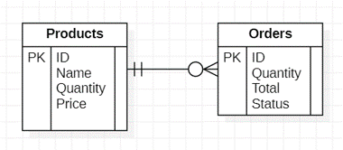

# MSA-Practice

Small project to practice MSA and Clean Architecture

Bad Project is a fast made api not following the clean architecture principles.
Good Project is the same app using microservices and trying to follow the clean architecture principle and TDD.

## Application presentation

The application is a very simple shopping application. You can see the list of all products, add a new product by filling its name, its price, and the quantity that can be sold. You can then order an amount of a product in the available quantity. The total price is automatically calculated by multiplying the price of the product by the quantity ordered. An order has 3 status : Pending, Completed and Cancelled. When you create a new order, its status is pending. Then the application checks if the order can be fulfilled. If it can, the status of the order changes automatically to Completed, else it changes to Cancelled. The checking process takes a few seconds.

### Entity-Relation model



### API endpoints

| Method | URL                          | Description                                        |
| ------ | ---------------------------- | -------------------------------------------------- |
| GET    | /products                    | Retrieves all products                             |
| GET    | /products/{productId}        | Retrieves a single product by its ID               |
| POST   | /products                    | Creates a new product                              |
| GET    | /orders                      | Retrieves all orders                               |
| GET    | /orders/{orderId}            | Retrieves a single order by its ID                 |
| POST   | /orders                      | Creates a new order                                |
| GET    | /products/{productId}/orders | Retrieves all orders of a single product by its ID |

## Bad Project installation

Requires python 3.10

```bash
docker run -d -p 6379:6379 redislabs/redismod
pip install fastapi "uvicorn[standard]" redis_om
uvicorn main:app --reload
```
